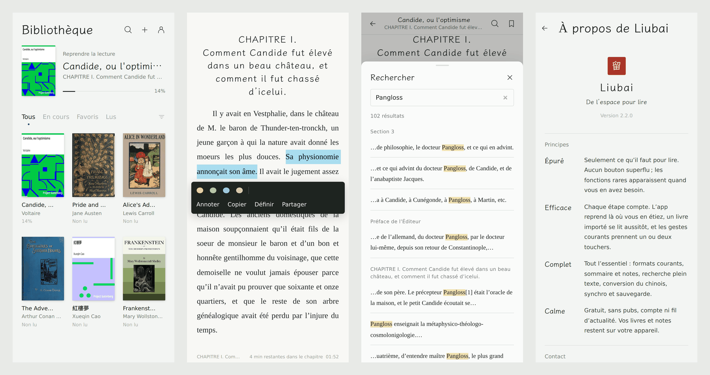
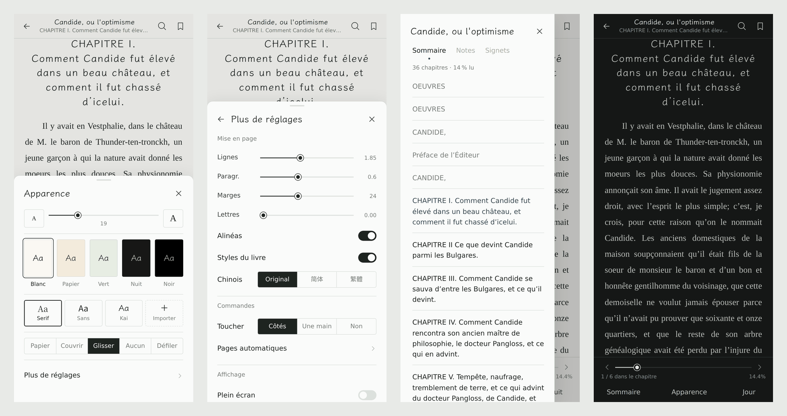

# Liubai 留白

De l’espace pour lire.

[English](README.md) · [简体中文](README.zh-CN.md) · [繁體中文](README.zh-TW.md) · **Français**

Une liseuse locale pour Android, épurée et efficace, qui a pourtant tout l’essentiel. Elle est gratuite, sans publicité, sans compte et sans fil d’actualité. Vos livres et vos notes restent sur votre appareil.





## Télécharger

Téléchargez le dernier APK dans les [Releases](https://github.com/Fan-dev-sktch/liubai-reader/releases/latest). Il faut Android 9 ou plus récent. Les nouvelles versions s’installent par-dessus les anciennes et gardent vos livres et vos notes.

## Principes

- **Épuré** : seulement ce qu’il faut pour lire. Aucun bouton superflu ; les fonctions rares apparaissent quand vous en avez besoin.
- **Efficace** : chaque étape compte. L’app reprend là où vous en étiez, un livre importé se lit aussitôt, et les gestes courants prennent un ou deux touchers.
- **Complet** : tout l’essentiel : formats courants, sommaire et notes, recherche plein texte, conversion du chinois, synchro et sauvegarde.
- **Calme** : gratuit, sans pubs, compte ni fil d’actualité. Vos livres et notes restent sur votre appareil.

## Fonctions

- **Formats** : EPUB, MOBI / AZW3, FB2, TXT (chapitres détectés automatiquement, règles modifiables), PDF, Markdown, HTML, BD au format CBZ
- **Lecture**
  - Pages tournées (papier, couvrir, glisser ou sans animation) ou défilement vertical
  - Taille du texte, interligne, espace entre paragraphes, marges et espacement des lettres réglables
  - Cinq thèmes, polices serif / sans / Kai, ou votre propre police
  - Conversion chinois simplifié ⇄ traditionnel qui garde la mise en page du livre
  - Mise en page qui suit le livre : police latine et césure pour les livres occidentaux, ponctuation chinoise pour les livres chinois
  - Zoom sur les images, notes de bas de page en fenêtre, retour d’un toucher après un lien
  - Double page sur tablette en paysage
- **Annotations**
  - Surlignage en quatre couleurs, notes et signets
  - Recherche plein texte avec résultats pendant la saisie (une recherche en chinois simplifié trouve aussi le texte traditionnel)
  - Recherche de mots dans l’app de dictionnaire ou de traduction de votre téléphone
- **Commandes** : pages tournées d’un toucher ou d’une main, touches de volume, défilement automatique des pages, plein écran immersif, écran toujours allumé, verrouillage de l’orientation, luminosité
- **Bibliothèque** : reprendre la lecture, filtrer et trier, sélection multiple, modifier le titre, l’auteur et la couverture, annuler après avoir retiré un livre
- **Données** : synchronisation WebDAV de la progression et des notes (Nextcloud, Nutstore…), sauvegarde et restauration, export des notes en Markdown, temps de lecture
- **Langues** : français, English, 简体中文 et 繁體中文. L’app suit la langue du téléphone, ou se règle dans Moi → Langue.
- **Appareils**
  - Fonctionne même avec l’ancienne WebView fournie avec Android 9
  - S’adapte aux petits écrans de 320 de large comme aux tablettes, écrans pliables et à encoche compris
  - Passe automatiquement à des effets de page plus légers sur les téléphones d’entrée de gamme

## Confidentialité

Pas de compte, pas de publicité, aucune statistique d’aucune sorte. Les livres, la progression et les notes sont enregistrés sur votre appareil. Liubai ne se connecte qu’à l’adresse WebDAV que vous saisissez vous-même, et seulement après que vous avez activé la synchronisation.

## Compilation

Le code source se trouve dans `www/` (l’application web) et `android/` (l’enveloppe WebView).

```bash
npm i -g esbuild acorn acorn-walk

# www/ → www-dist/ : syntaxe abaissée pour les anciennes WebView, replis CSS, minification
python3 build/build.py

# Empaqueter et signer l’APK (JDK 11+, Android SDK platform 35 et build-tools)
ANDROID_JAR=/path/to/android-35/android.jar \
BUILD_TOOLS=/path/to/build-tools/35.0.0 \
KEYSTORE=/path/to/your.jks KEYSTORE_PASS=... \
android/build-apk.sh
```

La clé de signature n’est pas dans le dépôt. Pour installer par-dessus une version existante, chaque build doit être signé avec la même clé.

Les textes de l’interface sont écrits en chinois simplifié et passent par `tr()`. L’anglais et le français se trouvent dans `i18n/en_fr.py`, et `i18n/zh_tw.py` contient les règles de vocabulaire taïwanais pour le chinois traditionnel. Après avoir modifié un texte de l’interface, régénérez la table (le script s’arrête s’il manque une traduction) :

```bash
NODE_PATH="$(npm root -g)" python3 build/gen-i18n.py
```

```
www/        la liseuse : app.js (interface et lecture), books.js (import et mise en page), pager.js (pagination),
            formats.js (MOBI / FB2 / CBZ), i18n.js et i18n-data.js (langues)
i18n/       traductions
build/      build de compatibilité, polyfills et générateur de traductions
android/    l’enveloppe Android : MainActivity.java, AndroidManifest.xml, build-apk.sh
```

## Contact

- E-mail : f5864131477@gmail.com
- WeChat : f5864131477

Retours et idées bienvenus, tout comme une discussion sur vos lectures.

## Remerciements et licence

Liubai s’appuie sur ces projets libres : [pdf.js](https://github.com/mozilla/pdf.js) (Apache-2.0), [foliate-js](https://github.com/johnfactotum/foliate-js) (MIT), [JSZip](https://github.com/Stuk/jszip) (MIT), [OpenCC](https://github.com/BYVoid/OpenCC) (Apache-2.0), [core-js](https://github.com/zloirock/core-js) (MIT), ainsi que les polices [LXGW WenKai](https://github.com/lxgw/LxgwWenKai) et [Source Han Serif / Noto Serif CJK](https://github.com/notofonts/noto-cjk) (SIL OFL-1.1). Les textes de leurs licences se trouvent dans `www/vendor/` et `www/fonts/`.

Le code et le design de Liubai appartiennent à son auteur, tous droits réservés.

Les livres des captures d’écran sont des œuvres du domaine public issues du [Projet Gutenberg](https://www.gutenberg.org/).
