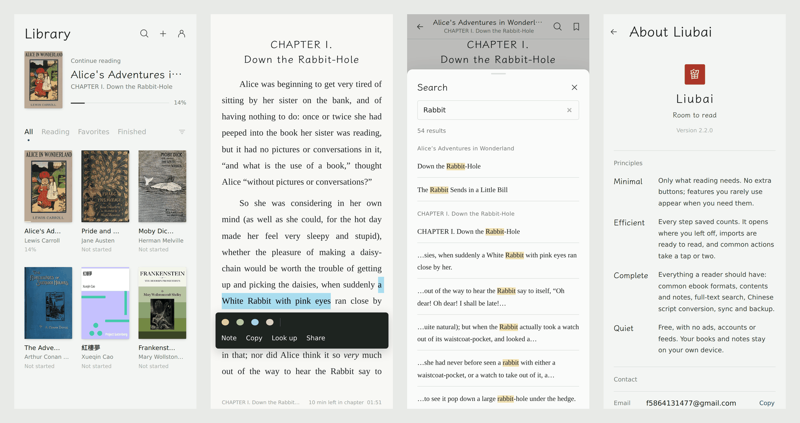
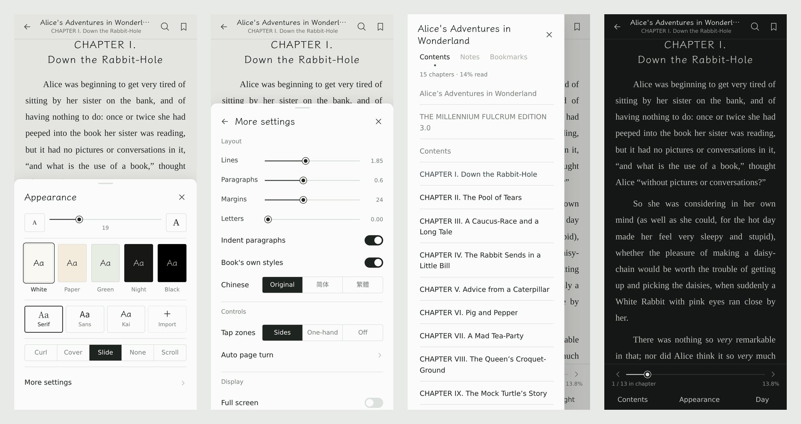

# Liubai 留白

Room to read.

**English** · [简体中文](README.zh-CN.md) · [繁體中文](README.zh-TW.md) · [Français](README.fr.md)

A minimal, efficient local e-book reader for Android that still has everything a reader needs. It's free, with no ads, no accounts and no feeds. Your books and notes stay on your own device.





## Download

Get the latest APK from [Releases](https://github.com/Fan-dev-sktch/liubai-reader/releases/latest). It needs Android 9 or later. New versions install over old ones and keep your books and notes.

## Principles

- **Minimal**: Only what reading needs. There are no extra buttons, and features you rarely use appear when you need them.
- **Efficient**: Every step saved counts. The app opens where you left off, imported books are ready to read, and common actions take a tap or two.
- **Complete**: Everything a reader should have: common e-book formats, contents and notes, full-text search, Chinese script conversion, sync and backup.
- **Quiet**: Free, with no ads, accounts or feeds. Your books and notes stay on your own device.

## Features

- **Formats**: EPUB, MOBI / AZW3, FB2, TXT (chapters are detected automatically, and you can change the rules), PDF, Markdown, HTML, CBZ comics
- **Reading**
  - Page turns (curl, cover, slide or none) or vertical scrolling
  - Adjustable font size, line spacing, paragraph spacing, margins and letter spacing
  - Five themes, serif / sans / Kai fonts, or a font of your own
  - Simplified ⇄ Traditional Chinese conversion that keeps the book's own layout
  - Typesetting that follows the book: Latin type and hyphenation for Western books, Chinese punctuation for Chinese ones
  - Tap images to zoom, footnote pop-ups, and one tap back after following a link
  - Two-page spreads on tablets in landscape
- **Notes**
  - Highlights in four colors, notes and bookmarks
  - Full-text search with results as you type (a Simplified Chinese search also finds Traditional text)
  - Look up words in the dictionary or translation app on your phone
- **Controls**: tap or one-handed page turns, volume keys, auto page turn, immersive full screen, keep screen on, orientation lock, brightness
- **Library**: continue reading, filter and sort, multi-select, edit title, author and cover, and undo after removing a book
- **Data**: WebDAV sync of progress and notes (Nextcloud, Nutstore and others), backup and restore, notes exported as Markdown, reading time
- **Languages**: English, Français, 简体中文 and 繁體中文. The app follows your phone's language, or you can pick one under Me → Language.
- **Devices**
  - Runs even on the old WebView that ships with Android 9
  - Fits small 320-wide screens up to tablets, including foldables and notched screens
  - Switches to lighter page-turn effects on low-end phones automatically

## Privacy

There are no accounts, no ads and no analytics of any kind. Books, progress and notes are stored on your device. Liubai connects only to the WebDAV address you enter yourself, and only after you turn on sync.

## Building

The source is in `www/` (the web app) and `android/` (the WebView shell).

```bash
npm i -g esbuild acorn acorn-walk

# www/ → www-dist/: lower the syntax for old WebViews, add CSS fallbacks and minify
python3 build/build.py

# Package and sign the APK (needs JDK 11+, Android SDK platform 35 and build-tools)
ANDROID_JAR=/path/to/android-35/android.jar \
BUILD_TOOLS=/path/to/build-tools/35.0.0 \
KEYSTORE=/path/to/your.jks KEYSTORE_PASS=... \
android/build-apk.sh
```

The signing key isn't in the repository. To install over an existing version, every build has to be signed with the same key.

UI text is written in Simplified Chinese and wrapped in `tr()`. English and French live in `i18n/en_fr.py`, and `i18n/zh_tw.py` holds the Taiwan wording rules for Traditional Chinese. After changing UI text, regenerate the table (the script stops if any string is missing a translation):

```bash
NODE_PATH="$(npm root -g)" python3 build/gen-i18n.py
```

```
www/        the reader: app.js (UI and reading), books.js (import and layout), pager.js (pagination),
            formats.js (MOBI / FB2 / CBZ), i18n.js and i18n-data.js (languages)
i18n/       translations
build/      compatibility build, polyfills and the translation generator
android/    the Android shell: MainActivity.java, AndroidManifest.xml, build-apk.sh
```

## Contact

- Email: f5864131477@gmail.com
- WeChat: f5864131477

Feedback and ideas are welcome, and so is a chat about what you're reading.

## Credits and license

Liubai uses these open-source projects: [pdf.js](https://github.com/mozilla/pdf.js) (Apache-2.0), [foliate-js](https://github.com/johnfactotum/foliate-js) (MIT), [JSZip](https://github.com/Stuk/jszip) (MIT), [OpenCC](https://github.com/BYVoid/OpenCC) (Apache-2.0), [core-js](https://github.com/zloirock/core-js) (MIT), and the fonts [LXGW WenKai](https://github.com/lxgw/LxgwWenKai) and [Source Han Serif / Noto Serif CJK](https://github.com/notofonts/noto-cjk) (SIL OFL-1.1). Their license texts are in `www/vendor/` and `www/fonts/`.

The code and design of Liubai itself are copyright of the author, all rights reserved.

The books in the screenshots are public-domain titles from [Project Gutenberg](https://www.gutenberg.org/).
