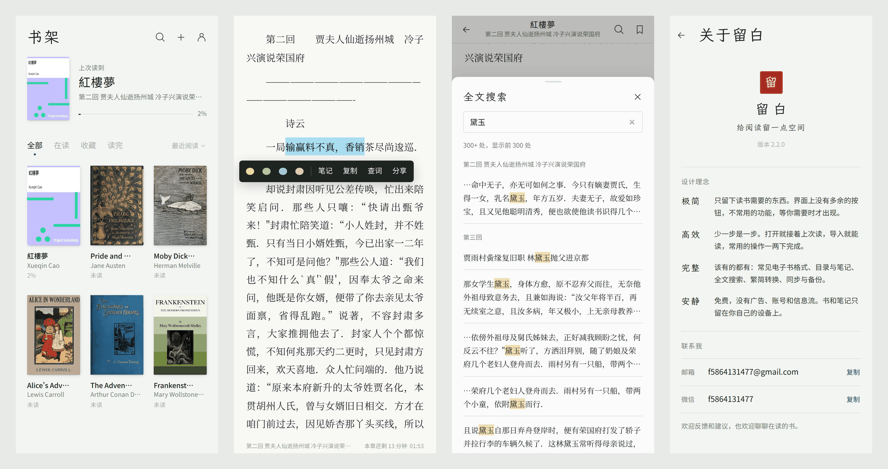
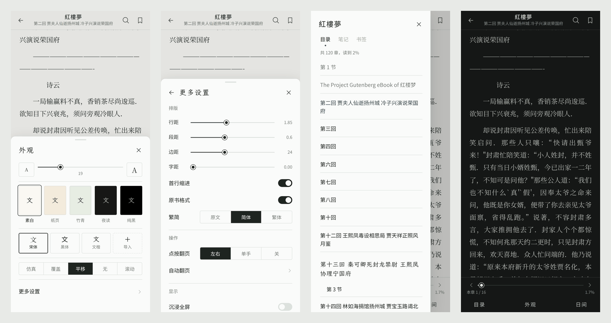

# 留白

给阅读留一点空间。

[English](README.md) · **简体中文** · [繁體中文](README.zh-TW.md) · [Français](README.fr.md)

一个极简、高效、该有的都有的安卓本地阅读器。免费，没有广告、账号和信息流，书和笔记只留在你自己的设备上。





## 下载

到 [Releases](https://github.com/Fan-dev-sktch/liubai-reader/releases/latest) 下载最新的 APK，支持 Android 9 及以上。新版本可以直接覆盖安装，书和笔记都会保留。

## 设计理念

- **极简**：只留下读书需要的东西。界面上没有多余的按钮，不常用的功能，等你需要时才出现。
- **高效**：少一步是一步。打开就接着上次读，导入就能读，常用的操作一两下完成。
- **完整**：该有的都有：常见电子书格式、目录与笔记、全文搜索、繁简转换、同步与备份。
- **安静**：免费，没有广告、账号和信息流。书和笔记只留在你自己的设备上。

## 功能

- **格式**：EPUB、MOBI / AZW3、FB2、TXT（自动分章，可以改规则）、PDF、Markdown、HTML、CBZ 漫画
- **阅读**
  - 左右翻页（仿真 / 覆盖 / 平移 / 无动画）或上下滚动
  - 字号、行距、段距、边距、字距可调
  - 五种主题，宋体 / 黑体 / 文楷，也可以导入自己的字体
  - 繁简转换，保留原书排版
  - 按书的语言排版：西文书用西文字体并自动断字，中文书保留中文标点
  - 点图放大，脚注弹窗，跳转后一键回到原处
  - 平板横屏双页
- **标注**
  - 四色划线、笔记、书签
  - 全文搜索，边打字边出结果，简体也能搜到繁体
  - 查词交给手机里的词典或翻译应用
- **操作**：点按或单手翻页、音量键翻页、自动翻页、沉浸全屏、屏幕常亮、屏幕方向锁定、亮度调节
- **书架**：继续阅读、筛选和排序、多选、编辑书名作者和封面，移出后可以撤销
- **数据**：WebDAV 同步进度和笔记（坚果云等）、备份与恢复、导出 Markdown 笔记、阅读记录
- **语言**：简体中文、繁體中文、English、Français，默认跟随手机语言，也可以在「我的 → 语言」里切换
- **适配**
  - Android 9 自带的旧版 WebView 也能运行
  - 屏幕从 320 宽的小屏到平板，也适配折叠屏和刘海屏
  - 低端机自动换成轻量的翻页效果

## 隐私

没有账号，没有广告，也没有任何统计。书、进度和笔记都保存在本机。留白只有在你开启同步时，才会连接你自己填写的 WebDAV 地址。

## 构建

源码在 `www/`（网页部分）和 `android/`（WebView 外壳）。

```bash
npm i -g esbuild acorn acorn-walk

# www/ → www-dist/：降级到旧版 WebView 能运行的语法，补上 CSS 回退并压缩
python3 build/build.py

# 打包并签名 APK（需要 JDK 11+、Android SDK platform 35 和 build-tools）
ANDROID_JAR=/path/to/android-35/android.jar \
BUILD_TOOLS=/path/to/build-tools/35.0.0 \
KEYSTORE=/path/to/your.jks KEYSTORE_PASS=... \
android/build-apk.sh
```

签名密钥不在仓库里。要覆盖安装已有的版本，必须一直用同一把密钥签名。

界面文字直接用简体中文写在代码里，外面包一层 `tr()`。英文和法文在 `i18n/en_fr.py`，繁体中文按 `i18n/zh_tw.py` 里的台湾用语规则转换。改了界面文字之后，重新生成翻译表（有没翻译的文字时脚本会停下来）：

```bash
NODE_PATH="$(npm root -g)" python3 build/gen-i18n.py
```

```
www/        阅读器本体：app.js（界面与阅读）、books.js（导入与排版）、pager.js（分页）、
            formats.js（MOBI / FB2 / CBZ）、i18n.js 与 i18n-data.js（多语言）
i18n/       翻译
build/      兼容构建脚本、polyfills 与翻译表生成脚本
android/    安卓外壳：MainActivity.java、AndroidManifest.xml、build-apk.sh
```

## 联系我

- 邮箱：f5864131477@gmail.com
- 微信：f5864131477

欢迎反馈和建议，也欢迎聊聊在读的书。

## 致谢与许可

留白用到了这些开源项目：[pdf.js](https://github.com/mozilla/pdf.js)（Apache-2.0）、[foliate-js](https://github.com/johnfactotum/foliate-js)（MIT）、[JSZip](https://github.com/Stuk/jszip)（MIT）、[OpenCC](https://github.com/BYVoid/OpenCC)（Apache-2.0）、[core-js](https://github.com/zloirock/core-js)（MIT），字体 [霞鹜文楷](https://github.com/lxgw/LxgwWenKai) 与 [思源宋体 / Noto Serif CJK](https://github.com/notofonts/noto-cjk)（SIL OFL-1.1）。许可文本见 `www/vendor/` 和 `www/fonts/`。

留白自身的代码与设计版权归作者所有。

截图里的书是 [Project Gutenberg](https://www.gutenberg.org/) 的公版书。
