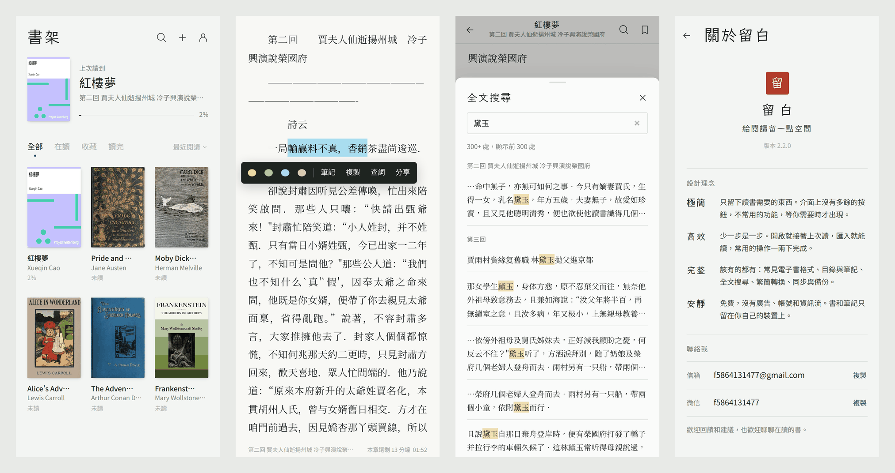
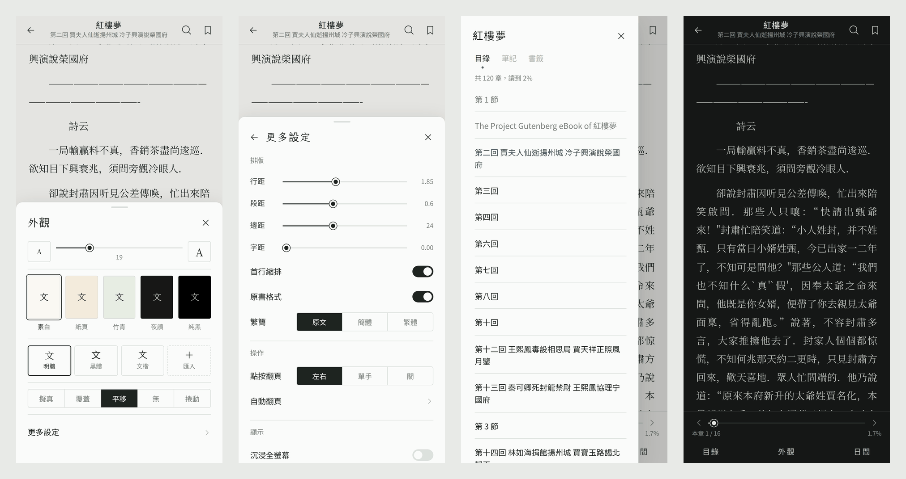

# 留白

給閱讀留一點空間。

[English](README.md) · [简体中文](README.zh-CN.md) · **繁體中文** · [Français](README.fr.md)

一個極簡、高效、該有的都有的 Android 本機閱讀器。免費，沒有廣告、帳號和資訊流，書和筆記只留在你自己的裝置上。





## 下載

到 [Releases](https://github.com/Fan-dev-sktch/liubai-reader/releases/latest) 下載最新的 APK，支援 Android 9 以上。新版本可以直接覆蓋安裝，書和筆記都會保留。

## 設計理念

- **極簡**：只留下讀書需要的東西。介面上沒有多餘的按鈕，不常用的功能，等你需要時才出現。
- **高效**：少一步是一步。開啟就接著上次讀，匯入就能讀，常用的操作一兩下完成。
- **完整**：該有的都有：常見電子書格式、目錄與筆記、全文搜尋、繁簡轉換、同步與備份。
- **安靜**：免費，沒有廣告、帳號和資訊流。書和筆記只留在你自己的裝置上。

## 功能

- **格式**：EPUB、MOBI / AZW3、FB2、TXT（自動分章，可以改規則）、PDF、Markdown、HTML、CBZ 漫畫
- **閱讀**
  - 左右翻頁（擬真 / 覆蓋 / 平移 / 無動畫）或上下捲動
  - 字級、行距、段距、邊距、字距可調
  - 五種主題，明體 / 黑體 / 文楷，也可以匯入自己的字型
  - 繁簡轉換，保留原書排版
  - 依書的語言排版：西文書用西文字型並自動斷字，中文書保留中文標點
  - 點圖放大，註腳彈出視窗，跳轉後一鍵回到原處
  - 平板橫向雙頁
- **標註**
  - 四色畫線、筆記、書籤
  - 全文搜尋，邊打字邊出結果，簡體也能搜到繁體
  - 查詞交給手機裡的字典或翻譯 App
- **操作**：點按或單手翻頁、音量鍵翻頁、自動翻頁、沉浸全螢幕、螢幕常亮、螢幕方向鎖定、亮度調整
- **書架**：繼續閱讀、篩選和排序、多選、編輯書名作者和封面，移出後可以復原
- **資料**：WebDAV 同步進度和筆記（堅果雲、Nextcloud 等）、備份與還原、匯出 Markdown 筆記、閱讀紀錄
- **語言**：繁體中文、简体中文、English、Français，預設跟隨手機語言，也可以在「我的 → 語言」裡切換
- **適配**
  - Android 9 內建的舊版 WebView 也能執行
  - 螢幕從 320 寬的小螢幕到平板，也適配摺疊機和瀏海螢幕
  - 低階手機自動換成輕量的翻頁效果

## 隱私

沒有帳號，沒有廣告，也沒有任何統計。書、進度和筆記都儲存在本機。留白只有在你開啟同步時，才會連線到你自己填寫的 WebDAV 位址。

## 建置

原始碼在 `www/`（網頁部分）和 `android/`（WebView 外殼）。

```bash
npm i -g esbuild acorn acorn-walk

# www/ → www-dist/：降級成舊版 WebView 能執行的語法，補上 CSS 回退並壓縮
python3 build/build.py

# 打包並簽署 APK（需要 JDK 11+、Android SDK platform 35 和 build-tools）
ANDROID_JAR=/path/to/android-35/android.jar \
BUILD_TOOLS=/path/to/build-tools/35.0.0 \
KEYSTORE=/path/to/your.jks KEYSTORE_PASS=... \
android/build-apk.sh
```

簽署金鑰不在儲存庫裡。要覆蓋安裝已有的版本，必須一直用同一把金鑰簽署。

介面文字直接用簡體中文寫在程式碼裡，外面包一層 `tr()`。英文和法文在 `i18n/en_fr.py`，繁體中文依照 `i18n/zh_tw.py` 裡的台灣用語規則轉換。改了介面文字之後，重新產生翻譯表（有文字還沒翻譯時，腳本會停下來）：

```bash
NODE_PATH="$(npm root -g)" python3 build/gen-i18n.py
```

```
www/        閱讀器本體：app.js（介面與閱讀）、books.js（匯入與排版）、pager.js（分頁）、
            formats.js（MOBI / FB2 / CBZ）、i18n.js 與 i18n-data.js（多語言）
i18n/       翻譯
build/      相容性建置腳本、polyfills 與翻譯表產生腳本
android/    Android 外殼：MainActivity.java、AndroidManifest.xml、build-apk.sh
```

## 聯絡我

- 信箱：f5864131477@gmail.com
- 微信：f5864131477

歡迎回饋和建議，也歡迎聊聊在讀的書。

## 致謝與授權

留白用到了這些開源專案：[pdf.js](https://github.com/mozilla/pdf.js)（Apache-2.0）、[foliate-js](https://github.com/johnfactotum/foliate-js)（MIT）、[JSZip](https://github.com/Stuk/jszip)（MIT）、[OpenCC](https://github.com/BYVoid/OpenCC)（Apache-2.0）、[core-js](https://github.com/zloirock/core-js)（MIT），字型 [霞鶩文楷](https://github.com/lxgw/LxgwWenKai) 與 [思源宋體 / Noto Serif CJK](https://github.com/notofonts/noto-cjk)（SIL OFL-1.1）。授權條款見 `www/vendor/` 和 `www/fonts/`。

留白本身的程式碼與設計版權歸作者所有。

截圖裡的書是 [Project Gutenberg](https://www.gutenberg.org/) 的公版書。
